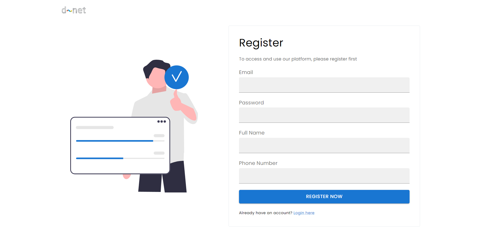
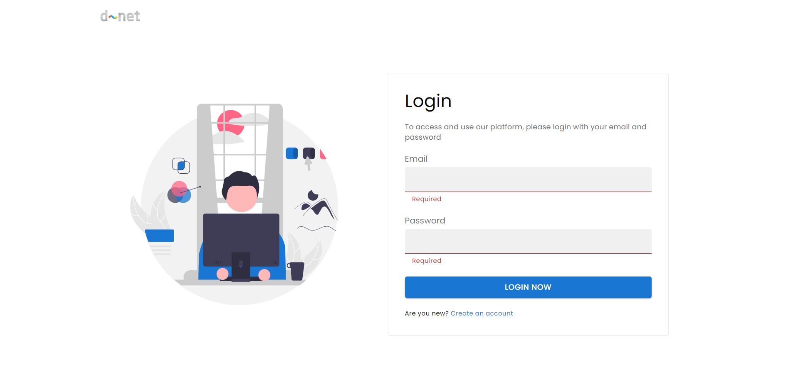
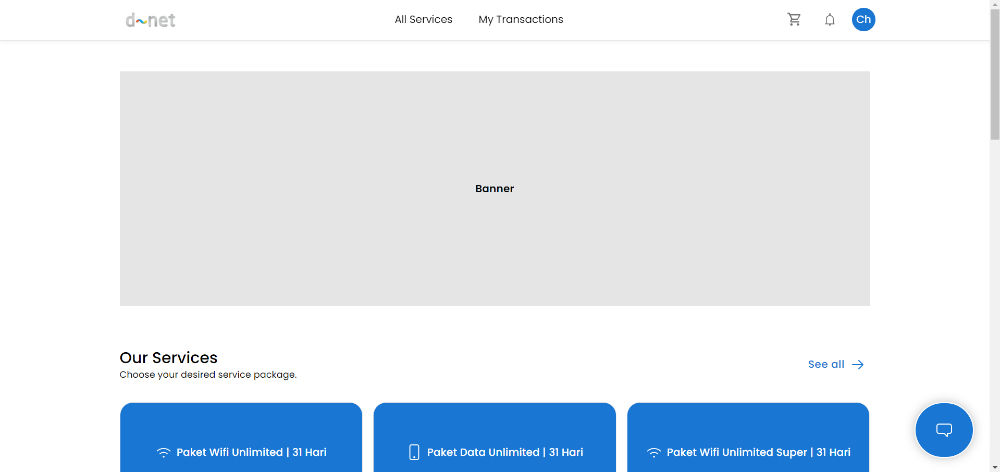
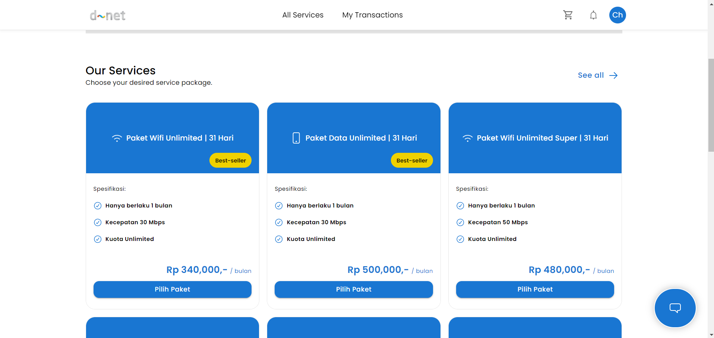
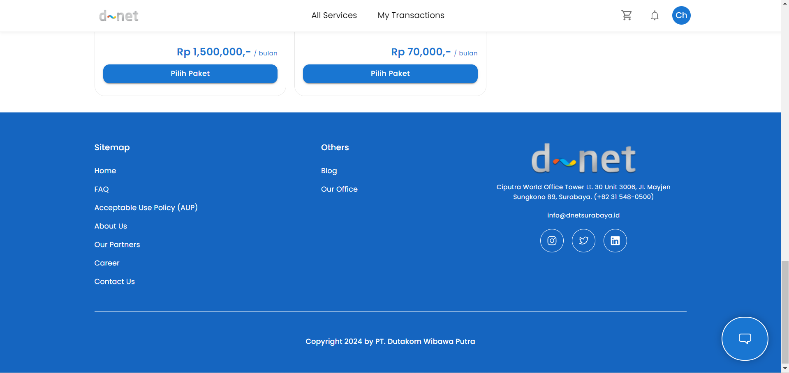
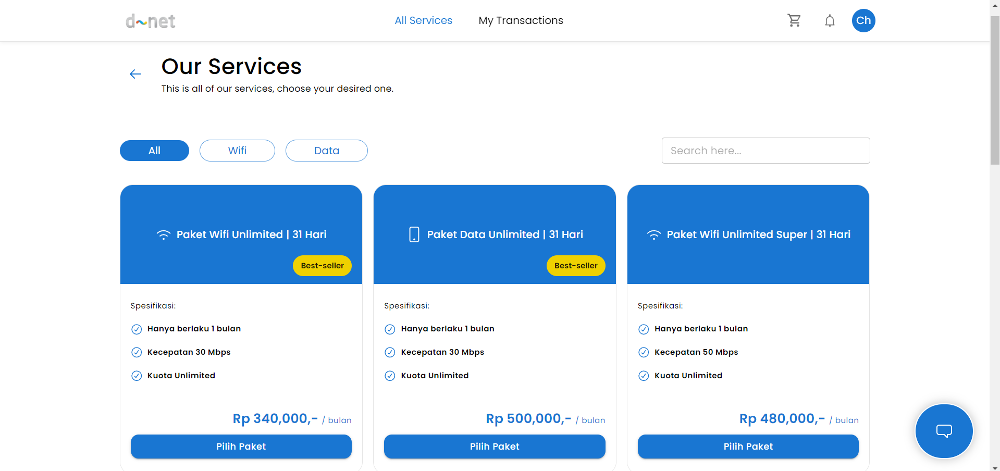
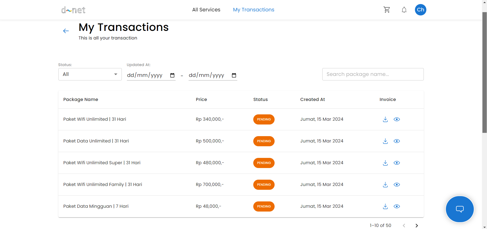
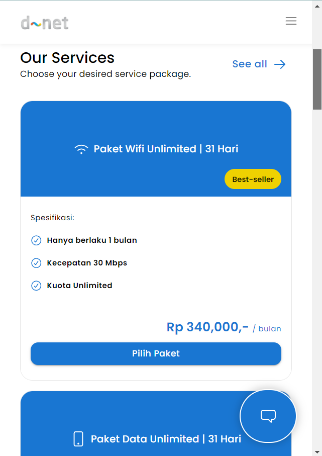
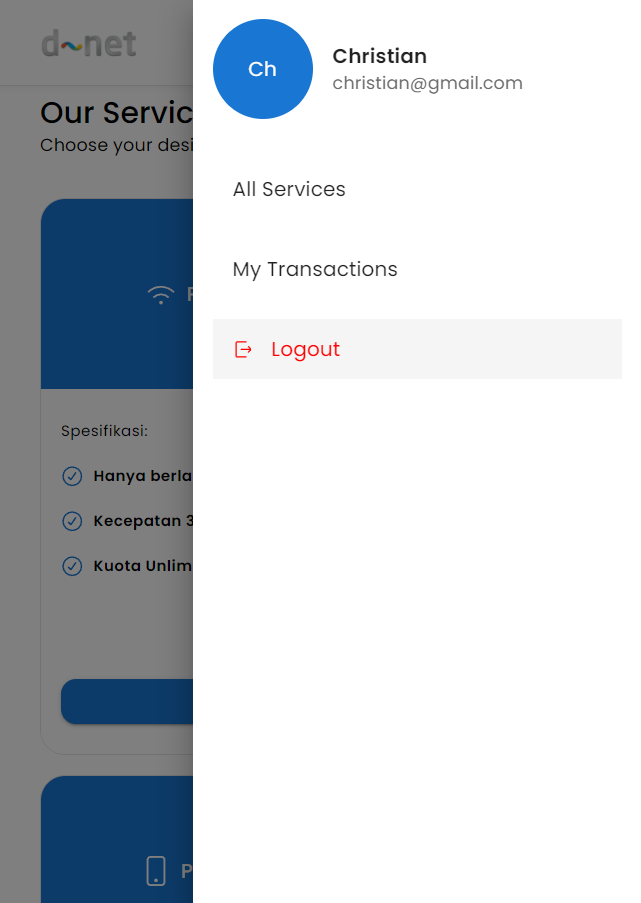

# D-Net ISP Demo Platform 

<h2>Overview</h2>

💻 TRY OUR DEPLOYED APP HERE : <a href="https://dnet-isp-platform.vercel.app/">https://dnet-isp-platform.vercel.app/</a>

🎥 Showcase Flow Aplikasi By Video ( Loom ) : 
- <a href="https://www.loom.com/share/0b330833679a4f97bf6fe098e2c90680?sid=582c1242-43c6-4272-9798-64d02ae7dfc9">Part 1 : Web Dektop View</a>
- <a href="https://www.loom.com/share/443e7d7769f44d58b544a8e3f57de717?sid=ba13fdd3-9471-4494-886f-278948ccc555">Part 2 : Mobile Responsive View</a>

📁 Folder structure inspired by : <a href="https://github.com/alan2207/bulletproof-react/blob/master/docs/project-structure.md"> bulletproof react folder structure </a>

⚙️ Tools & Libraries : React+Vite, Tanstack-router, Tanstack-query + axios, Supabase for backend, etc.

⏱️ Duration : Finished this in around 2-3 days, while working a full-time job!

<h2>Local Setup</h2>

1. ```git clone https://github.com/darren-ct/dnet-isp-platform.git```
2. ```npm install```
3. ```npm run dev```
4. You are up and running!

<h2>REST API Endpoints (supported by Supabase)</h2>

1. REGISTER : ```POST /signup```
2. LOGIN : ```POST /token?grant_type=password```
3. LOGOUT : ```POST /logout```
4. GET USER : ```GET /user```

5. FIND ALL INTERNET PACKAGES : ```GET /internet_packages```

6. FIND MY TRANSACTIONS : ```GET /my_transactions?user_id=[userId]```
7. CREATE NEW MY TRANSACTION : ```POST /my_transactions```

<h2>Application Overview</h2>

<h4> 1. Register & Login Pages </h4>





<h4> 2. Home Page </h4>







<h4> 3. Services Page </h4>



<h4> 4. My Transactions Page </h4>



<h5> 5. Some Responsive Proof!</h5>




